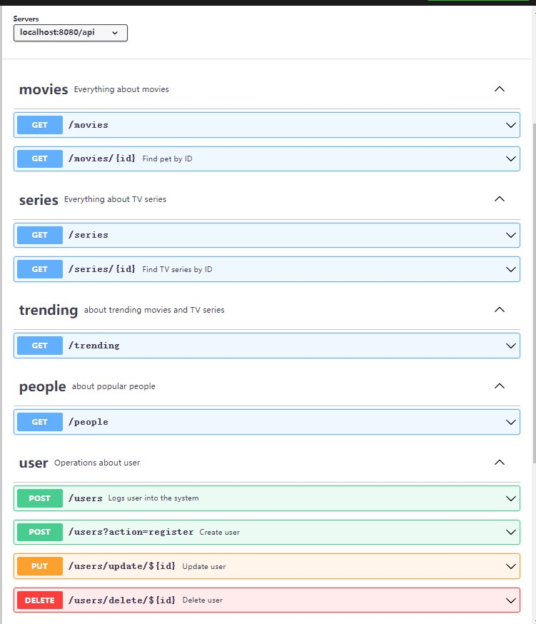
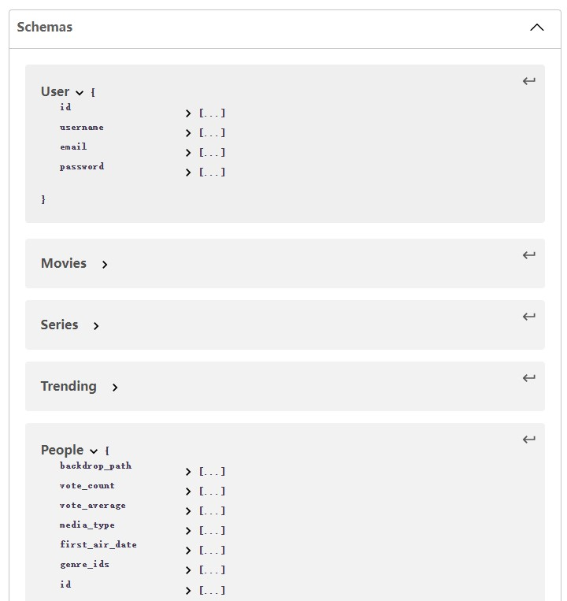

# Assignment 2 - Web API.

Name: Yifei Ma

## Features.

A bullet-point list of the ADDITIONAL features you have implemented in the API **THAT WERE NOT IN THE LABS** (or modifications to existing features)

- user cannot see popular people before login(protected route).
- use self define API in trending and people page.
- delete top rated page(for adding setting page, otherwise the navigation will be ugly :)
- midify login and register page
- add update user information page
- add the feature of delete exist user.

## Setup requirements.

No

## API Configuration

Describe any configuration that needs to take place before running the API. For example, creating an `.env` file and what variables to put in it. Give an example of how this might be done.

I have `.env` respectively in reactApp folder and movies-api folder.

REMEMBER: DON'T PUT YOUR OWN USERNAMES/PASSWORDS/AUTH KEYS IN THE README OR ON GITHUB, just placeholders as indicated below:

---

NODEENV=development
PORT=8080
HOST=
mongoDB=YourMongoURL
seedDb=true
secret=YourJWTSecret

---

## API Design

An overview of your web API design

- /api/movies | GET | Gets a list of movies `movies-api/api/movies`
- /api/movies/{movieid} | GET | Gets a single movie `movies-api/api/movies`
- /api/series | GET | Gets a list of TV series `movies-api/api/series`
- /api/series/{id} | GET | Gets a single TV series `movies-api/api/series`
- /api/people | GET | Gets a list of popular actors `movies-api/api/people`
- /api/trending | GET | Gets a list of trending movies/TV series `movies-api/api/trending`
- /api/user | GET | Gets a list of users `movies-api/api/users`
- /api/users?action=register | POST | add a new user`movies-api/api/users`
- /api/users/update/${id} | PUT | modify information of exist user.`movies-api/api/users`
- /api/users/delete/${id} | DELETE | delete exist user from user list.`movies-api/api/users`

swaggerAPI document: [Yml Document](./APIDocument.yml)

## Security and Authentication

Give details of authentication/security implemented on the API (e.g. passport/sessions). Indicate which routes are protected.

## Integrating with React App

Describe how you integrated your React app with the API. List the views that use your Web API instead of the TMDB API. Describe any other updates to the React app from Assignment One.
